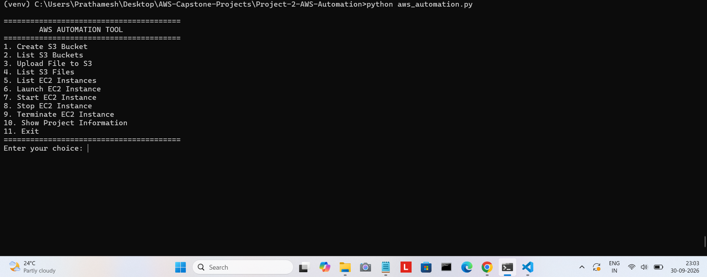
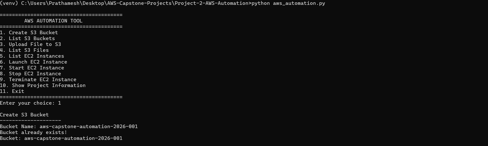
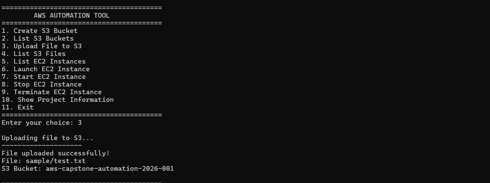
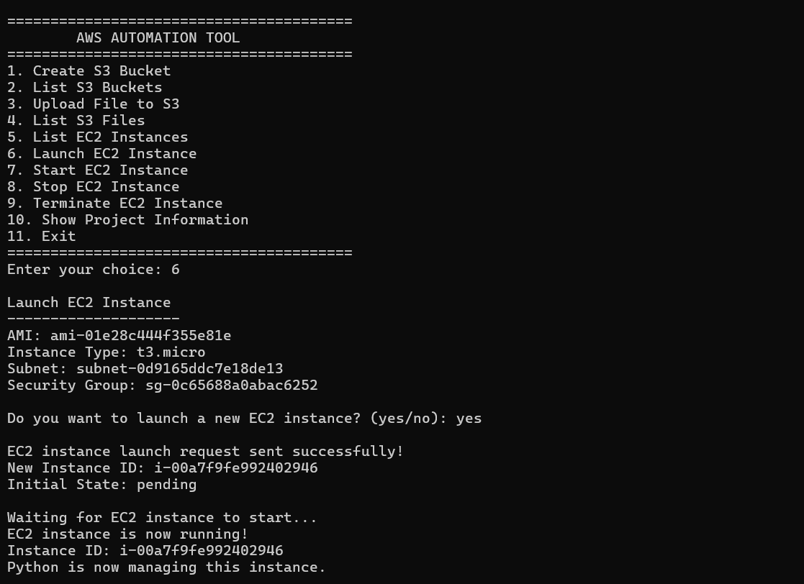
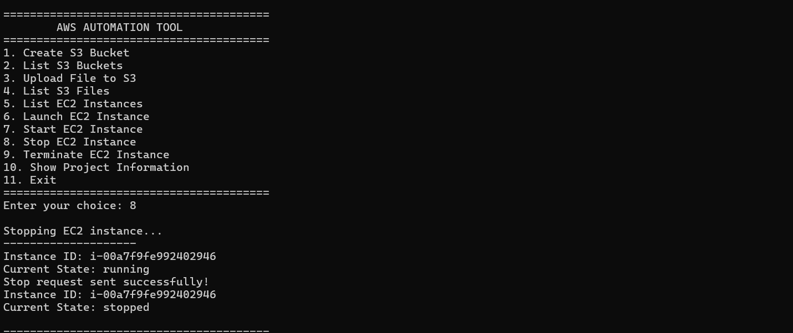
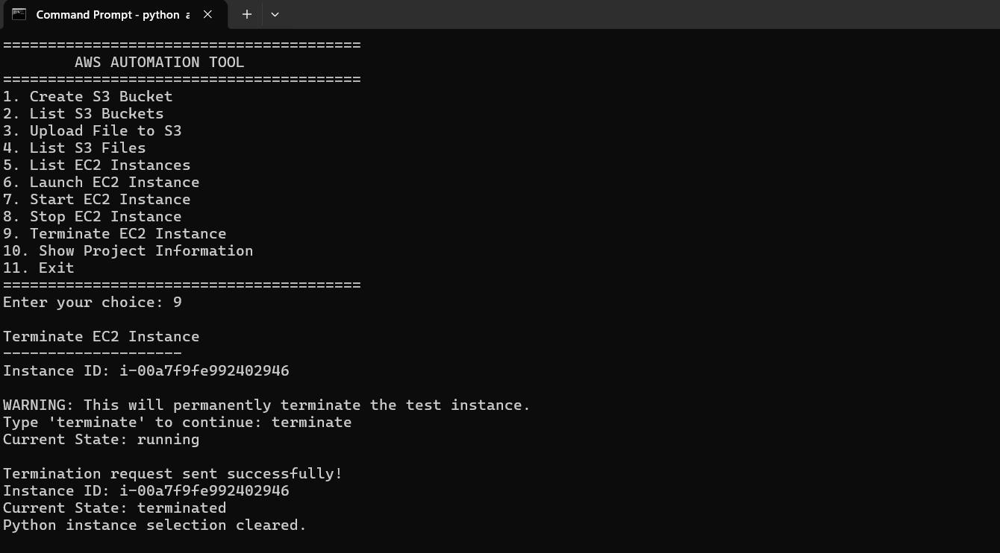

# Project 2 — AWS Resource Automation Using Python and Boto3


## 1. Project Overview


This project demonstrates AWS resource automation using **Python and Boto3**.


Instead of manually performing AWS operations through the AWS Management Console, this project provides a **Python command-line interface (CLI)** to automate common operations on Amazon S3 and Amazon EC2.


The project demonstrates how Python can communicate with AWS services through the Boto3 SDK.


---


## 2. Objective


The main objectives of this project are:


* Automate AWS resource operations using Python.

* Use Boto3 to communicate with AWS services.

* Automate Amazon S3 bucket and file operations.

* Automate Amazon EC2 instance management.

* Use IAM to control permissions.

* Demonstrate secure AWS credential handling.

* Provide a simple menu-driven CLI for AWS automation.


---


## 3. AWS Services Used


| AWS Service | Purpose                                       |

| ----------- | --------------------------------------------- |

| Amazon S3   | Bucket creation, file upload and file listing |

| Amazon EC2  | Instance listing, start, stop and termination |

| AWS IAM     | User, group and permission management         |


---


## 4. Technologies Used


* Python 3

* Boto3

* AWS CLI

* Amazon S3

* Amazon EC2

* AWS IAM

* Windows Command Prompt


---


## 5. Architecture


```text

&#x20;                 USER

&#x20;                   |

&#x20;                   v

&#x20;            Python CLI Tool

&#x20;                   |

&#x20;                   v

&#x20;                Boto3

&#x20;                   |

&#x20;            AWS API Requests

&#x20;                   |

&#x20;         +---------+---------+

&#x20;         |                   |

&#x20;         v                   v

&#x20;    Amazon S3            Amazon EC2

&#x20;         |                   |

&#x20;     Buckets \& Files     EC2 Instances

```


---


## 6. How the Project Works


The user interacts with a menu-driven Python application.


The Python application uses **Boto3**, the AWS SDK for Python, to send API requests to AWS.


The application can perform operations such as:


### S3 Operations


1\. Create/check an S3 bucket

2\. List S3 buckets

3\. Upload a file

4\. List files stored in the bucket


### EC2 Operations


1\. List EC2 instances

2\. Launch an EC2 instance

3\. Start an EC2 instance

4\. Stop an EC2 instance

5\. Terminate an EC2 instance


---


## 7. Project Structure


```text

Project-2-AWS-Automation/

│

├── aws_automation.py

├── README.md

├── requirements.txt

├── .gitignore

│

├── sample/

│   └── test.txt

│

└── screenshots/

```


---

## 7.1 Screenshots

### CLI Menu


### S3 Bucket


### S3 Upload


### S3 Files


### EC2 Launch


### EC2 Stop


### EC2 Start


### EC2 Terminate


### Project Information


---

## 8. AWS Configuration


The project uses a dedicated AWS CLI profile:


```text

aws-capstone

```


The Python application creates a Boto3 session using this profile.


```python

session = boto3.Session(

&#x20;   profile_name="aws-capstone",

&#x20;   region_name="ap-south-1"

)

```


The AWS region used for this project is:


```text

ap-south-1

```


Mumbai Region.


---


## 9. IAM Configuration


A dedicated IAM user was created for this automation project.


### IAM User


```text

aws-capstone-automation

```


### IAM Group


```text

aws-capstone-automation-group

```


### IAM Policy


```text

AWS-Capstone-Automation-Policy

```


The policy provides the permissions required by the Python automation program for S3 and EC2 operations.


The project follows the principle of granting only the permissions required for the automation tasks.


---


## 10. S3 Automation


The application can check whether the required S3 bucket exists.


Bucket used for the project:


```text

aws-capstone-automation-2026-001

```


### File Upload


The application uploads:


```text

sample/test.txt

```


to the S3 bucket using Boto3.


Example:


```python

s3.upload_file(

&#x20;   file_path,

&#x20;   bucket_name,

&#x20;   "test.txt"

)

```


### Result


```text

File uploaded successfully!

File: sample/test.txt

S3 Bucket: aws-capstone-automation-2026-001

```


The application can also list objects stored in the bucket.


Example result:


```text

Files in S3 bucket:

--------------------

test.txt

```


---


## 11. EC2 Automation


The application can manage EC2 instances using Boto3.


### EC2 Configuration


```text

Instance Type: t3.micro

AMI: Amazon Linux 2023

Region: ap-south-1

```


The application supports:


```text

List EC2 Instances

Launch EC2 Instance

Start EC2 Instance

Stop EC2 Instance

Terminate EC2 Instance

```


---


## 12. Dynamic EC2 Instance Selection


The application can automatically find the project EC2 instance using its Name tag.


```text

aws-capstone-automation-ec2

```


This allows the application to select an existing project instance instead of requiring the user to manually enter an instance ID.


Example output:


```text

Selected EC2 instance: i-0019a1c9bff31e04f

```


---


## 13. EC2 Lifecycle Testing


The EC2 automation was tested through the following lifecycle:


```text

Running

&#x20;  |

&#x20;  v

Stop

&#x20;  |

&#x20;  v

Stopped

&#x20;  |

&#x20;  v

Start

&#x20;  |

&#x20;  v

Running

&#x20;  |

&#x20;  v

Terminate

&#x20;  |

&#x20;  v

Terminated

```


The project successfully demonstrated:


* EC2 listing

* EC2 stop

* EC2 start

* EC2 termination


---


## 14. CLI Menu


The application provides the following menu:


```text

========================================

&#x20;       AWS AUTOMATION TOOL

========================================


1\. Create S3 Bucket

2\. List S3 Buckets

3\. Upload File to S3

4\. List S3 Files

5\. List EC2 Instances

6\. Launch EC2 Instance

7\. Start EC2 Instance

8\. Stop EC2 Instance

9\. Terminate EC2 Instance

10\. Show Project Information

11\. Exit


========================================

```


---


## 15. Project Information


The application can display the project configuration, including:


* Project name

* Python version/SDK information

* AWS region

* S3 bucket

* EC2 AMI

* Instance type

* VPC

* Subnet

* Security Group


---


## 16. Testing Results


The following operations were successfully tested:


| Operation              | Result     |

| ---------------------- | ---------- |

| S3 bucket check        | Successful |

| S3 bucket listing      | Successful |

| S3 file upload         | Successful |

| S3 file listing        | Successful |

| EC2 instance listing   | Successful |

| EC2 instance selection | Successful |

| EC2 stop               | Successful |

| EC2 start              | Successful |

| EC2 termination        | Successful |

| Project information    | Successful |


---


## 17. Installation


Clone the repository:


```bash

git clone <YOUR-GITHUB-REPOSITORY-URL>

```


Move into the project directory:


```bash

cd Project-2-AWS-Automation

```


Create a virtual environment:


```bash

python -m venv venv

```


Activate it on Windows:


```bash

venv\\Scripts\\activate

```


Install dependencies:


```bash

pip install -r requirements.txt

```


---


## 18. AWS CLI Configuration


Configure the AWS CLI profile:


```bash

aws configure --profile aws-capstone

```


Verify the identity:


```bash

aws sts get-caller-identity --profile aws-capstone

```


The AWS credentials should remain stored securely and must never be uploaded to GitHub.


---


## 19. Run the Application


Run:


```bash

python aws_automation.py

```


The application will display the AWS Automation Tool menu.


Select the required operation by entering the corresponding menu number.


---


## 20. Security Practices


The following security practices were followed:


* AWS credentials are not stored inside the Python source code.

* AWS credentials are not uploaded to GitHub.

* Private `.pem` files are excluded using `.gitignore`.

* AWS credential directories are excluded using `.gitignore`.

* A dedicated IAM user and group are used for this project.

* Permissions are provided through an IAM policy.

* The project uses an AWS CLI profile for authentication.


---


## 21. Key Learnings


Through this project, I learned:


* How Boto3 communicates with AWS services.

* How to automate S3 operations using Python.

* How to automate EC2 operations using Python.

* How to use AWS IAM for permissions.

* How to configure and use an AWS CLI profile.

* How to create a menu-driven AWS automation tool.

* How to manage EC2 instance lifecycle operations programmatically.

* How to follow basic AWS security practices.


---


## 22. Future Improvements


Possible improvements include:


* Add automated EC2 status monitoring.

* Add support for multiple S3 buckets.

* Add logging for AWS operations.

* Add error-specific exception handling.

* Add command-line arguments.

* Add support for additional AWS services such as Lambda and DynamoDB.


---


## 23. Conclusion


This project demonstrates how AWS resource management tasks can be automated using Python and Boto3.


The application provides a simple CLI through which users can perform common Amazon S3 and Amazon EC2 operations while using AWS IAM for access control.


The project provides practical experience with AWS automation, Python programming, Boto3, IAM, S3, EC2, and AWS CLI configuration.


